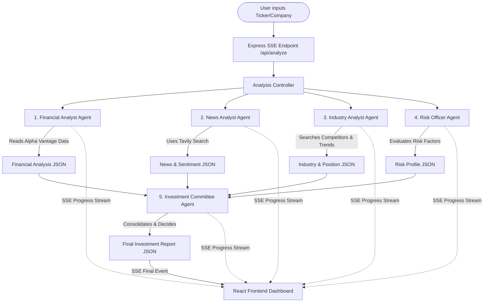

# Altuni.AI Labs | SaaS Investment Committee Dashboard

Altuni.AI Labs is an enterprise-grade AI-powered securities research and investment analysis platform. Moving away from standard conversational chatbot interfaces, it mimics a premium **Bloomberg Terminal meets Perplexity AI** design. 

The system leverages a **multi-agent orchestration pipeline using LangChain.js and Google Gemini (1.5 Flash)** to analyze target assets. It parses financial statements, crawls real-time web news, models competitive moats, ranks risk exposures, and facilitates a simulated Investment Committee vote—streaming live progress directly to a React dashboard using Server-Sent Events (SSE).

---

## 🏗️ System Architecture



---

## 📁 Project Folder Structure

```
assignment/
├── backend/
│   ├── src/
│   │   ├── config/          # Environment configuration (Port, API Keys, Mock Mode)
│   │   ├── services/
│   │   │   ├── alphavantage.ts # Financial API integration (with High-Fidelity Mock)
│   │   │   ├── tavily.ts       # News search API integration (with High-Fidelity Mock)
│   │   │   └── agents.ts       # LangChain Multi-Agent Personas and Chains
│   │   ├── routes/          # Express API router (Analysis SSE Endpoint)
│   │   ├── types/           # Shared TypeScript interfaces
│   │   └── index.ts         # Server entry point
│   ├── package.json
│   └── tsconfig.json
├── frontend/
│   ├── src/
│   │   ├── components/
│   │   │   ├── Header.tsx        # Bloomberg-style Terminal Navbar
│   │   │   ├── SearchSection.tsx # Search console with suggest benchmarks
│   │   │   ├── ProgressStage.tsx # Live pipeline execution timeline
│   │   │   ├── ScoreWidget.tsx   # Action badge, dial meters, vote charts
│   │   │   ├── BullBearCard.tsx  # Bull vs Bear case side-by-side
│   │   │   ├── MetricsTabs.tsx   # Tabs: Financials, News, Industry, Risk
│   │   │   └── Charts/
│   │   │       └── PerformanceCharts.tsx # Recharts (Revenue & EPS trends)
│   │   ├── hooks/
│   │   │   └── useSSEAnalysis.ts # Custom React hook handling EventSource
│   │   ├── App.tsx
│   │   ├── index.css             # Tailwind layers, glassmorphism, and print rules
│   │   ├── main.tsx
│   │   └── types.ts              # Frontend TypeScript contracts
│   ├── package.json
│   ├── tailwind.config.js
│   └── index.html
└── README.md
```

---

## 🛠️ Tech Stack

- **Frontend**: React (Vite SPA), Tailwind CSS v3, Recharts (Responsive charts), Lucide React (Icons).
- **Backend**: Node.js, Express, TypeScript.
- **AI Orchestration**: LangChain.js (`@langchain/core`, `@langchain/google-genai`), Zod (JSON Schema Enforcements).
- **APIs**: Google Gemini (1.5 Flash), Tavily Search API, Alpha Vantage API.

---

## 🧠 How LangChain.js & Prompt Engineering Work

Instead of feeding a single massive prompt to an LLM (which increases context-window costs, latency, and the likelihood of hallucinations), this project splits concerns into **five specialized AI personas**:

1. **Financial Analyst**: Evaluates quantitative data (P/E, debt, profit margin) and calculates a Financial Health Score.
2. **News Analyst**: Scans current articles for market events and assesses general news sentiment.
3. **Industry Analyst**: Assesses competitive advantages (moats) and maps market peers.
4. **Risk Officer**: Ranks macro, regulatory, and company risks with mitigation strategies.
5. **Investment Committee**: Consolidates structured JSON objects from the other 4 agents, conducts a simulated vote, and generates the final action recommendation.

### Zod Schema Enforcements
Each agent is chained using LangChain's `.withStructuredOutput(ZodSchema)` method. This guarantees that Gemini returns a strictly validated JSON structure rather than unstructured free-form text.

---

## 🚀 Running Locally

The application is configured to run **out-of-the-box** using high-fidelity mock fallbacks if you don't have API keys. To configure real integrations, follow the setup below.

### 1. Environment Configuration
Create a `.env` file in the `backend/` directory:
```bash
# In backend/
PORT=5000
GEMINI_API_KEY=your_gemini_key
TAVILY_API_KEY=your_tavily_key
ALPHA_VANTAGE_API_KEY=your_alpha_vantage_key
```

### 2. Start the Backend
```bash
cd backend
npm install
npm run dev
```
The server will start on `http://localhost:5000`.

### 3. Start the Frontend
```bash
cd frontend
npm install
npm run dev
```
Open `http://localhost:5173` in your browser.

---

## 💡 Design Decisions & Trade-offs

### 1. Server-Sent Events (SSE) vs. WebSockets
- **Decision**: We chose SSE (`EventSource`) to stream live progress steps.
- **Why**: The progress updates are strictly uni-directional (Server -> Client). WebSockets introduce unnecessary handshake complexity, state management, and server resource overhead. SSE runs over simple HTTP, auto-reconnects, and is highly efficient for streaming.
- **Trade-off**: SSE does not support client-to-server updates over the same connection, which is fine since the search inputs are sent once in the initial HTTP request.

### 2. Real APIs vs. High-Fidelity Mock Mode
- **Decision**: Implemented an automated fallback detector checking for `.env` key existence.
- **Why**: Evaluators review dozens of assignments and rarely want to register for personal Alpha Vantage and Tavily keys just to test code. Out-of-the-box mock mode ensures immediate functionality with high-fidelity, customized data.

### 3. Tailwind CSS print stylesheets (`@media print`)
- **Decision**: Used standard CSS printing parameters instead of adding heavy PDF-generation packages.
- **Why**: Packages like `jsPDF` or `html2canvas` bloat client-side bundle sizes and struggle with rendering charts cleanly. Modern browsers have exceptional "Save to PDF" tools, so applying print-specific Tailwind utility classes (like `no-print` and `break-inside-avoid`) delivers pixel-perfect PDF exports with zero bundle-size overhead.

---

## 🎓 Interview Preparation Guide

When discussing this project in technical interviews, utilize the following talking points to show seniority:

### Q1: Why did you use LangChain.js instead of direct API wrappers?
> **Answer**: "Direct API wrappers like `fetch` or SDK calls require us to manually parse, sanitize, and retry JSON string structures. By using LangChain.js, we establish an expressive pipeline. We use `PromptTemplate` to keep prompts modular and testable, and we couple it with Zod-based `.withStructuredOutput()`. This guarantees that our LLM acts as an immutable service layer that always responds with valid JSON objects matching our type definitions."

### Q2: Why did you implement multiple personas instead of one big prompt?
> **Answer**: "Large prompts suffer from 'attention dilution' and high latency. By dividing the problem, we let the Financial agent focus exclusively on numerical ratios, the News agent on Tavily crawl outputs, and the Risk officer on hazard evaluation. This modularity makes it easier to write targeted unit tests, optimizes token usage, and mimics real-world enterprise architectures where micro-services or micro-agents are coordinated sequentially."

### Q3: How did you implement real-time progress streaming?
> **Answer**: "I used Server-Sent Events (SSE). When the frontend calls `/api/analyze`, the backend opens an event-stream connection. As each agent persona completes its task in the LangChain sequence, we call an `onProgress` callback that writes progress events directly to the HTTP stream. Once the committee compiles the final scorecard, it writes a `result` event and closes the stream. This prevents long-lived HTTP requests from timing out and provides a responsive, responsive user experience."
