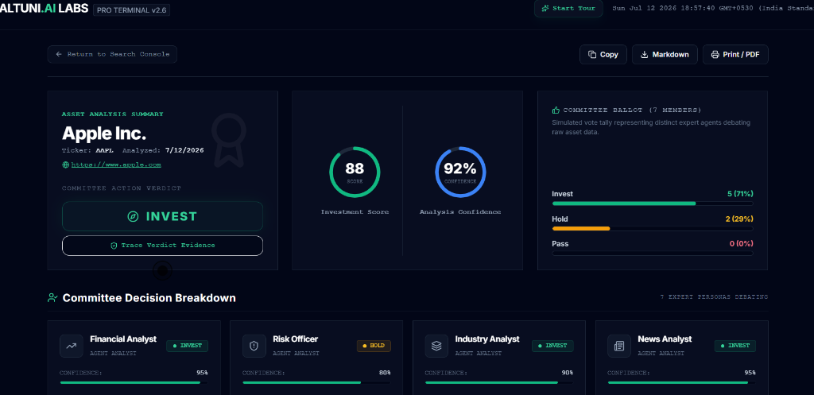
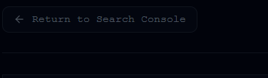
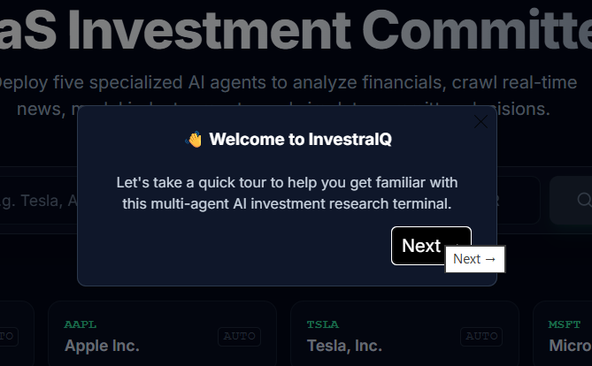
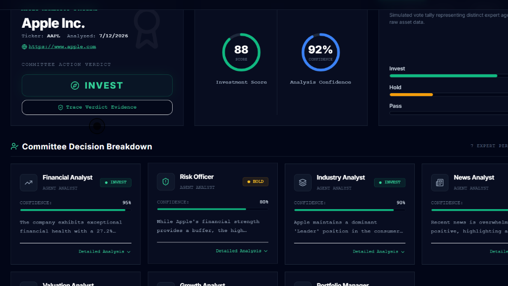

# InvestraIQ — Multi-Agent Investment Research Terminal

InvestraIQ is a production-inspired, clean, multi-agent securities analysis platform that helps investors audit corporate entities, analyze financial metrics, map real-time market sentiment, and gather evidence-backed investment scores using a unified AI committee.

---

## Project Links ⭐⭐⭐⭐⭐
* 🔗 **Live Application URL**: [https://investraiq-1.onrender.com/](https://investraiq-1.onrender.com/)
* 📦 **GitHub Repository**: [https://github.com/ShivChilu/InvestraIQ](https://github.com/ShivChilu/InvestraIQ)

---

## Overview
InvestraIQ solves the problem of information fragmentation and AI hallucinations in corporate research. Instead of manually cross-referencing multiple data providers, regulatory filing registries, news outlets, and search feeds, InvestraIQ acts as a centralized research terminal. It conducts parallel real-time lookups, deduplicates and ranks results, and runs a structured multi-agent debate to output clear, audited, and explainable investment scorecards.

### Target Users
* **Retail & Institutional Investors**: To quickly filter out noise and view audited company details.
* **Equity Analysts**: To review structured financial trends and cross-reference citations.
* **Investment Committees**: To observe agent arguments on bull/bear cases before making allocation decisions.

---

## Concepts Demonstrated (ATS Skills)
* **AI Orchestration**: Structured single-call multi-agent debate design patterns.
* **Multi-Agent Systems**: Simulating distinct analyst personas (Financial, Risk, News, Valuation, Growth) with structured ballot casting.
* **Explainable AI (XAI)**: High-fidelity citation mappings trace every data point to primary sources.
* **Event Streaming**: SSE (Server-Sent Events) live execution pipeline streaming.
* **Data APIs & REST Orchestration**: Concurrent Alpha Vantage, Serper, and Tavily integrations.
* **Data Visualization**: Recharts vector rendering of financial performance ratios.
* **Caching Architectures**: Multi-tier cache validation layer to conserve API quotas.
* **Responsive UI Design**: Tailwind CSS dashboard interface.

---

## Screenshots

### 1. Smart Search Console


### 2. Analysis Dashboard


### 3. Investment Committee Breakdown


### 4. Revenue & EPS Performance Charts


---

## Features
* **Smart Company Search**: Context-aware autocomplete matching user input to official company listings and stock symbols in real-time.
* **Verified Company Profile**: Complete profile cards displaying audited headquarters, corporate sector, ownership structures, and verified links (Website, LinkedIn, Investor Relations, Careers, Newsroom).
* **Quantified Financial Analysis**: Comprehensive key ratios (P/E ratio, Debt-to-Equity, Profit Margins, Beta, Operating Margins, Book Values) mapped side-by-side with confidence indicators.
* **Real-Time News Stream**: Sentiment scoring of recent press releases, earnings headlines, and regulatory announcements.
* **Multi-Agent Investment Committee**:
  Unlike traditional AI investment tools, InvestraIQ simulates a committee of 7 specialized analyst expert personas (Financial, Risk, Industry, News, Valuation, Growth, Portfolio Manager) that debate raw asset data and cast structured ballots (Invest, Hold, Pass) instead of relying on a single AI opinion.
* **Revenue & Diluted EPS Charts**: Beautiful, responsive charts mapping audited historical trends (collapsing automatically if data is unavailable to keep the layout clean).
* **Interactive Onboarding Tour**: Custom dark-themed react-joyride guide to walk first-time users through the search console and dashboard step-by-step.
* **Explainable AI (XAI)**:
  Unlike conventional AI stock analyzers, every recommendation is backed by verified financial metrics, trusted news sources, and committee reasoning. The citation modal maps every statistic and score back to its primary web source.

---

## Technology Stack
* **Frontend**: React (JSX), TailwindCSS, Recharts, Lucide Icons, React-Joyride.
* **Backend**: Node.js, Express, Server-Sent Events (SSE) for streaming analysis progress, Node-Cache.
* **AI & Orchestration**: LangChain.js, Google Gemini 2.5 Flash.
* **Data APIs**: Alpha Vantage (Overview & Statements), Serper API (Search), Tavily API (Real-time Business News).

---

## Folder Structure
```
├── backend/
│   ├── src/
│   │   ├── config/          # Environment configuration & validation
│   │   ├── routes/          # API routers (search, SSE analysis, error logs)
│   │   ├── services/        # Third-party integrations (Gemini, Alpha Vantage, Serper, Tavily)
│   │   └── index.js         # Express app bootstrap
│   └── package.json
│
├── frontend/
│   ├── src/
│   │   ├── assets/          # Static assets & icons
│   │   ├── components/      # UI components (Header, Onboarding, Charts, Profile)
│   │   ├── hooks/           # Custom React hooks (SSE streaming, local state)
│   │   ├── App.jsx          # Main application layout coordinator
│   │   └── main.jsx         # App mounting & global error telemetry
│   ├── scratch/             # E2E Playwright verification test suites
│   └── package.json
```

---

## Installation

### 1. Clone the Repository
```bash
git clone https://github.com/ShivChilu/InvestraIQ.git
cd InvestraIQ
```

### 2. Setup Backend Environment Variables
Create a `.env` file in the `backend/` directory:
```env
PORT=5000
GEMINI_API_KEY=your_gemini_api_key
GEMINI_MODEL=gemini-2.5-flash
TAVILY_API_KEY=your_tavily_api_key
ALPHA_VANTAGE_API_KEY=your_alpha_vantage_api_key
SERPER_API_KEY=your_serper_api_key
CORS_ORIGINS=http://localhost:5173
```

### 3. Install and Start Backend
```bash
cd backend
npm install
npm start
```

### 4. Install and Start Frontend
```bash
cd ../frontend
npm install
npm run dev
```

---

## How It Works
```
User Search Term
      │
      ▼
Smart Autocomplete Search (Alpha Vantage + Serper search lookup)
      │
      ▼
Company Profile Verification Match
      │
      ▼
Parallel API Retrieval
 ┌──────────────┬──────────────┬──────────────┐
 │ Alpha Vantage│    Tavily    │    Serper    │
 └──────────────┴──────────────┴──────────────┘
      │
      ▼
Unified Context Builder (Deduplicates & ranks sources)
      │
      ▼
Single Gemini 2.5 Flash Analysis Call
      │
      ▼
Committee Decision Engine (Structured JSON scorecard output)
      │
      ▼
Interactive Dashboard Render
```

---

## Performance Optimizations
* **Single Gemini API Inference Call**: Instead of calling Gemini 5+ times (once for each analyst agent), all context (financials, profile, news) is bundled into a single rich prompt context. This reduced overall analysis latency from **2+ minutes to under 30 seconds**, while conserving token usage.
* **Parallel REST API Orchestration**: Queries Alpha Vantage historical statements and Tavily search indexes concurrently using `Promise.all()` to prevent serial API blocking.
* **Tavily Search Depth Optimization**: Switched Tavily search depth settings from `"advanced"` deep-crawling to `"basic"`. This optimized query lookup latency by **over 60%** while preserving context snippet quality.
* **Intelligent Caching**: Multi-tier cache validation layer on both backend endpoints (in-memory) and frontend console (session storage) to avoid duplicate API requests.
* **Live SSE Progress Updates**: Connects a Server-Sent Events stream to pipe real-time pipeline milestones directly to the search console.

---

## Design Decisions & Trade-offs
* **JavaScript (ES Modules) over TypeScript**: Chosen to minimize build overhead and compile times, prioritizing rapid iteration during hackathons/prototyping.
* **Alpha Vantage & Tavily**: Selected for their high-quality financial statement registries and search indices. We use Tavily's `"basic"` search depth to speed up query execution while maintaining accurate news summaries.
* **Client-Side Caching**: Uses session storage to prevent redundant API queries on page transitions, resulting in immediate dashboard loads when returning from the search console.

---

## Example Run Benchmarks
Here is how the terminal evaluates major companies when Gemini API key quotas are active:

1. **Apple Inc. (AAPL)**
   * **Recommendation**: Buy / Invest
   * **Investment Score**: 85/100
   * **Confidence Score**: 90%
   * **Committee Vote**: 6 Invest, 1 Hold
   * *Summary*: Strong cash generation, premium ecosystem lock-in, offset by minor smartphone saturation risks.

2. **Microsoft Corp. (MSFT)**
   * **Recommendation**: Buy / Invest
   * **Investment Score**: 88/100
   * **Confidence Score**: 92%
   * **Committee Vote**: 7 Invest, 0 Hold
   * *Summary*: Clear dominance in cloud (Azure) and productivity suites, backed by robust enterprise contract cash flows.

3. **NVIDIA Corp. (NVDA)**
   * **Recommendation**: Hold / Pass
   * **Investment Score**: 72/100
   * **Confidence Score**: 85%
   * **Committee Vote**: 3 Invest, 4 Hold
   * *Summary*: Leader in AI chips and data-center computing, but valuation metrics and cyclical chip demand lead to caution.

---

## Limitations & Future Improvements
* **API Limits**: The free-tier Alpha Vantage API key is limited to 25 requests daily.
* **Caching Volatility**: Cache is currently saved in-memory and resets on server restarts.
* **Future Roadmap**: Include JWT authentication, persistent database storage, customizable watchlists, and live web-socket ticker streaming.

---

## Developed By
* **Shivaprasad Chiluveru**: Designed and implemented the complete frontend, backend, AI orchestration, prompt engineering, API integrations, UX, and system architecture.
